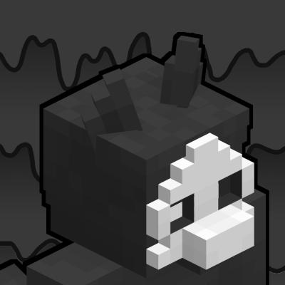

      
    
    
    
    

---

This repository holds the source code for the **Changed: Minecraft Mod**. Releases are compiled and published to both Modrinth and Curseforge. Credits for contributors are available on [GitHub Insights](https://github.com/LtxProgrammer/Changed-Minecraft-Mod/graphs/contributors) and in the mod menu.

## How can I help?
Any aspiring developer is welcome to fork and create a pull request to submit their content. Programmers, texture artists, and 3D modelers all have a place here.
- Textures are kept in *src/main/resources/assets/changed/textures*
- Java code is in *src/main/java/net/ltxprogrammer/changed*
- 3D models are kept in *3dmodels*

Even if you aren't a developer, you can help with translations, documentation, or other simple issues. However, any changes you make to the code or files should be on your own fork. Create a pull request when you are ready to submit any changes.

## Expectation of Quality
We strive to keep the code and assets of the Changed: Minecraft Mod at a excellent level of quality. All pull requests and issues are subject to be reviewed for quality assurance. Some quality points to keep in mind:
- Keep translation files organized (reference `en_us.json` for order/layout)
- Code should be efficient, well thought out, and should be able to handle most variations of mod environments.
- Code comments (if any) should be written in English. Comments are only necessary if the code may be difficult to understand
- Textures should fit Minecraft's vanilla style.
- 3D should use textures to show small/medium detail, and should reserve additional parts for large details.
- Issues should be written clearly in English

Submitting content that fails to meet quality expectations isn't an issue, and can be a good learning experience on what can be improved. However, excessively submitting issues/pull requests that repeatedly fail to meet quality expectations will result in a warning, and then a ban from contributing.

## How can I make my own extension mod?

Please refer to the [wiki](https://github.com/LtxProgrammer/Changed-Minecraft-Mod/wiki) for tutorials on setting up, and using the API.

## How can I compile the mod?

Without a IDE and assuming you have `git` installed and Java 17 as your default java:
- Clone the repo `git clone https://github.com/LtxProgrammer/Changed-Minecraft-Mod.git`
- Navigate into the directory `cd Changed-Minecraft-Mod`
- Run Gradlew `./gradlew build` (Linux/MacOS) or `gradlew build` (Windows)
- Once completed, check builds/libs for the results.

Now you can test the latest commit of the mod, enjoy.
